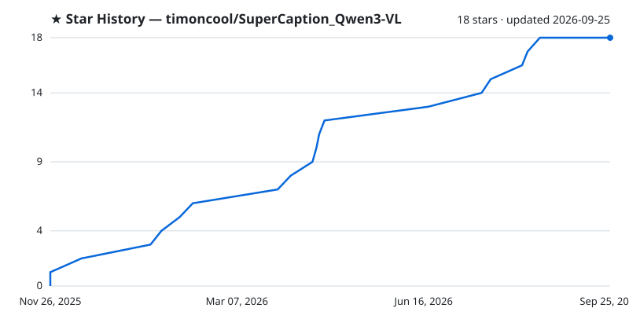

<div align="center">

# SuperCaption Qwen3-VL

**Портативный генератор описаний и тегов для фото/видео — Qwen3 Vision, 50+ шаблонов, установка в один клик, 100% офлайн.**

[](https://github.com/timoncool/SuperCaption_Qwen3-VL/stargazers)
[](LICENSE)
[](https://github.com/timoncool/SuperCaption_Qwen3-VL/commits)
[](https://github.com/timoncool/SuperCaption_Qwen3-VL/releases)

**[English](README_EN.md)** · **[中文](README_CN.md)**

</div>

---

## О модели Qwen3-VL

**Qwen3-VL** — это мультимодальная модель от Alibaba Cloud, способная понимать изображения и видео. Модель анализирует визуальный контент и генерирует текстовые описания.

**Важно:** Qwen3-VL работает только с визуальной информацией (изображения, видеокадры). Модель **не понимает аудио** — музыку, речь и звуковые эффекты она не анализирует.

Ключевые возможности модели:
- Понимание изображений любого разрешения
- Анализ видео (покадровый)
- OCR на 20+ языках
- Object Detection с координатами
- Режим рассуждений (Thinking) для сложных задач

Подробнее: [Qwen3-VL на GitHub](https://github.com/QwenLM/Qwen3-VL)

---

## Основные возможности

### 📷 Работа с изображениями

| Функция | Описание |
|---------|----------|
| **Описание изображений** | Генерация описаний в 50+ стилях: формальный, креативный, SEO, товарный, для соцсетей и др. |
| **OCR** | Распознавание текста с любых изображений |
| **Object Detection** | Обнаружение и локализация объектов с bounding boxes |
| **Сравнение изображений** | Анализ нескольких изображений (до/после, контроль качества) |
| **Пакетная обработка** | Обработка сотен изображений одновременно |

### 🎬 Работа с видео

| Функция | Описание |
|---------|----------|
| **Анализ видео** | Описание видеоконтента по кадрам с таймстампами |
| **Обнаружение действий** | Определение моментов конкретных действий в видео |
| **Анализ монтажа** | Оценка переходов, темпа, стиля съёмки |
| **Пакетная обработка видео** | Обработка множества видеофайлов |

### 🧠 Интеллектуальные функции

| Функция | Описание |
|---------|----------|
| **Thinking Mode** | Режим рассуждений (Chain-of-Thought) для сложных задач |
| **Решение задач** | Математические задачи и логические вопросы пошагово |
| **Анализ графиков** | Извлечение данных из диаграмм и визуализаций |
| **Причинно-следственный анализ** | Понимание последовательности событий |

### 💾 Экспорт и интеграция

| Функция | Описание |
|---------|----------|
| **Экспорт TXT** | Один файл на каждое изображение |
| **Экспорт JSON** | Все результаты в структурированном формате |
| **Экспорт CSV** | Табличный формат для Excel/Google Sheets |
| **Пресеты промптов** | Сохранение и загрузка часто используемых промптов |

---

## Типы описаний (50+ шаблонов)

### 📝 Базовые описания
- **Описательный (формальный)** — детальное формальное описание
- **Описательный (неформальный)** — дружелюбное непринуждённое описание
- **Описание товара** — для интернет-магазинов и маркетплейсов
- **SEO описание** — оптимизированное для поисковиков (до 160 символов)
- **Пост для соцсетей** — привлекательная подпись для Instagram/VK/Telegram

### 🎨 Промпты для генерации
- **Промпт Stable Diffusion** — детальный промпт для воссоздания изображения в SD
- **Промпт MidJourney** — промпт в формате MidJourney
- **Теги Booru** — теги в стиле Danbooru/Gelbooru через запятую
- **Анализ искусствоведа** — композиция, стиль, цвет, освещение

### 📍 OCR и распознавание текста
- **Извлечь весь текст** — полное OCR всех слов, цифр и символов
- **Текст с координатами** — текст + позиции в формате JSON с bbox
- **Таблица в HTML** — конвертация таблиц в HTML-теги
- **Структурированный JSON** — извлечение в key-value формате

### 🔀 Сравнение изображений
- **Сравнить товары** — анализ различий между продуктами
- **Сравнение до/после** — оценка изменений и улучшений
- **Анализ временного ряда** — тренды и прогнозы по последовательности
- **Контроль качества** — выявление дефектов, сортировка брак/годный

### 📍 Object Detection
- **Обнаружить объекты с местоположением** — JSON с bbox_2d и labels
- **Визуальная привязка** — описание с координатами каждого объекта
- **Найти и указать местоположение** — поиск конкретных объектов

### 🧠 Аналитические режимы
- **Математика пошагово** — решение задач с подробными шагами
- **Логический анализ** — структурированный разбор сцены
- **Причинно-следственный анализ** — понимание "что произошло и почему"
- **Внимательный анализ** — глубокое изучение перед ответом

### 📊 Специализированные анализы
- **Анализ графиков** — тип, оси, тренды, выводы
- **Визуализация данных** — извлечение числовых данных
- **Медицинское изображение** — анализ с медицинской терминологией
- **Техническая диаграмма** — компоненты и их взаимодействие
- **Извлечение из документа** — структурированные данные в JSON
- **Научное изображение** — описание научных явлений

### 🎬 Видео-специфичные режимы
- **Временная шкала событий** — хронология с таймстампами
- **Обнаружение действий** — поиск конкретных действий в видео
- **Резюме длинного видео** — краткое содержание
- **Анализ монтажа** — оценка переходов и стиля

### 📚 Образовательные
- **Объясни концепцию** — простое объяснение сложного
- **Решение задачи из учебника** — пошаговые вычисления
- **Исторический анализ** — контекст и значимость
- **Лабораторная работа** — описание оборудования и процедуры

### 🎨 Творческие
- **Цветовой анализ** — палитра, контрасты, гармония, настроение
- **Архитектурный анализ** — стиль, материалы, культурное значение
- **Анализ блюда** — как шеф-повар: ингредиенты, техника, подача
- **Презентация/Слайд** — содержание и структура слайда
- **Промышленная безопасность** — риски и рекомендации

### 🎯 Композиционные
- **Анализ композиции по слоям** — фон, средний план, передний план
- **Пространственный анализ** — компоновка, перспектива, отношения объектов
- **Поиск проблем** — что работает, что улучшить

### 💡 Свои промпты
Помимо готовых шаблонов вы можете писать **любые собственные промпты** на естественном языке — модель их поймёт. Просто опишите что вам нужно: "Опиши эту фотографию как будто ты турагент", "Найди все ошибки на этом скриншоте", "Составь список покупок по фото холодильника" и т.д.

**Совет:** При выборе шаблона его текст появляется в поле ввода — вы можете сразу отредактировать его под свою задачу.

---

## Пакетная обработка (Batch Mode)

Приложение поддерживает пакетную обработку для массовой генерации описаний:

1. **Загрузите несколько файлов** — перетащите папку или выберите несколько изображений/видео
2. **Выберите промпт** — один промпт будет применён ко всем файлам
3. **Запустите обработку** — результаты генерируются последовательно
4. **Экспортируйте результаты** — в TXT (отдельный файл на каждое изображение), JSON или CSV

**Особенности:**
- Прогресс отображается в реальном времени
- Можно остановить обработку в любой момент
- Результаты сохраняются даже при прерывании
- Поддерживается экспорт в папку с исходными файлами

---

## Скриншоты

### OCR — распознавание текста


### Описание изображений


### Анализ видео


### Пакетная обработка


### Сравнение нескольких изображений


### Решение математических задач


### Object Detection — обнаружение объектов


### Выбор версии CUDA при установке


---

## Доступные модели

### Abliterated (без цензуры) — рекомендуемые

| Модель | Размер | VRAM (4-bit) | Особенности |
|--------|--------|--------------|-------------|
| Huihui-Qwen3-VL-2B-Instruct-abliterated | 2B | ~2 GB | Быстрая, для слабых GPU |
| Huihui-Qwen3-VL-2B-Thinking-abliterated | 2B | ~2 GB | С режимом рассуждений |
| Huihui-Qwen3-VL-4B-Instruct-abliterated | 4B | ~4 GB | Баланс скорости и качества |
| Huihui-Qwen3-VL-4B-Thinking-abliterated | 4B | ~4 GB | С режимом рассуждений |
| Huihui-Qwen3-VL-8B-Instruct-abliterated | 8B | ~6 GB | Высокое качество |
| Huihui-Qwen3-VL-8B-Thinking-abliterated | 8B | ~6 GB | С режимом рассуждений |
| Huihui-Qwen3-VL-32B-Instruct-abliterated | 32B | ~20 GB | Максимальное качество |
| Huihui-Qwen3-VL-32B-Thinking-abliterated | 32B | ~20 GB | С режимом рассуждений |

### Оригинальные Qwen (с цензурой)

| Модель | Размер | VRAM (4-bit) |
|--------|--------|--------------|
| Qwen3-VL-2B-Instruct | 2B | ~2 GB |
| Qwen3-VL-4B-Instruct | 4B | ~4 GB |
| Qwen3-VL-8B-Instruct | 8B | ~6 GB |

**Thinking модели** включают режим Chain-of-Thought — модель "думает вслух", показывая ход рассуждений перед финальным ответом. Полезно для сложных задач.

---

## Установка

### Windows (рекомендуется)

1. Скачайте и распакуйте архив
2. Запустите `install.bat` для установки зависимостей
3. **Выберите версию CUDA при установке:**
   - Появится список поколений видеокарт NVIDIA с версиями CUDA
   - Введите номер вашей видеокарты (например, `3` для RTX 30xx) и нажмите **Enter**
   - Нажмите **Enter** ещё раз для подтверждения выбора

   

4. Запустите `run.bat` для запуска приложения

### Запуск с автообновлением

Используйте `run_with_update.bat` для автоматической проверки и загрузки обновлений при каждом запуске:

```
run_with_update.bat
```

Скрипт автоматически:
- Проверяет наличие обновлений в git-репозитории
- Скачивает новые версии кода
- Запускает приложение

### Ручная установка

```bash
# Клонирование репозитория
git clone https://github.com/timoncool/SuperCaption_Qwen3-VL.git
cd qwen3-vl

# Создание виртуального окружения
python -m venv venv

# Активация (Windows)
venv\Scripts\activate

# Активация (Linux/Mac)
source venv/bin/activate

# Установка зависимостей
pip install -r requirements.txt

# Запуск
python app.py
```

Приложение запустится на `http://localhost:7860`

---

## Структура проекта

```
qwen3-vl/
├── app.py              # Основное приложение (веб-интерфейс Gradio)
├── install.bat         # Установщик для Windows
├── run.bat             # Запуск приложения
├── run_with_update.bat # Запуск с автообновлением из git
├── requirements.txt    # Зависимости Python
├── prompts/            # Папка для пресетов промптов
├── temp/               # Временные файлы
├── output/             # Результаты экспорта
├── datasets/           # Датасеты для обучения
├── screenshots/        # Скриншоты интерфейса
└── README.md
```

---

## Требования

### Минимальные
- **Git** — для автообновлений (скачать: [git-scm.com](https://git-scm.com/downloads))
- **Python** 3.10+ (встроен в портативную версию)
- **CUDA** совместимая видеокарта (NVIDIA)
- **VRAM**: 4 GB (для 2B модели с 4-bit квантизацией)
- **RAM**: 8 GB

### Рекомендуемые
- **VRAM**: 8+ GB (для 8B модели)
- **RAM**: 16+ GB
- **SSD**: для быстрой загрузки моделей

---

## Устранение проблем

### CUDA out of memory
- Используйте модель меньшего размера (2B или 4B)
- Включите 4-bit квантизацию
- Закройте другие приложения использующие GPU
- Уменьшите max_tokens

### Модель не загружается
- Проверьте подключение к интернету
- Убедитесь что достаточно места на диске (модели от 2 до 20 GB)
- Модели кэшируются в `~/.cache/huggingface/` или локально в `models/`

### Медленная генерация
- Используйте 4-bit квантизацию
- Выберите модель меньшего размера
- Уменьшите количество кадров для видео

### Ошибки при обработке видео
- Убедитесь что ffprobe/ffmpeg установлен
- Проверьте формат видео (поддерживаются MP4, AVI, MOV, MKV)

### Текст обрывается на середине
- Увеличьте значение **Max Tokens** в настройках
- Модель прекращает генерацию когда достигает лимита токенов
- Рекомендуемые значения: 512-2048 для коротких описаний, 2048-4096 для длинных

### Текст повторяется и дублируется
- Уменьшите значение **Max Tokens** в настройках
- Слишком большой лимит токенов может приводить к зацикливанию генерации
- Попробуйте значения: 256-512 для простых задач, 1024 для сложных

---

## Для разработчиков

Этот проект — отличная начальная точка для создания вашего собственного приложения на базе Qwen3-VL. Просто удалите ненужные шаблоны промптов и добавьте вашу бизнес-логику. Структура проекта готова для расширения.

---

**Оригинальная модель:** [Qwen3-VL](https://github.com/QwenLM/Qwen3-VL) от Alibaba Cloud

## Лицензия

Проект использует модели [Qwen](https://github.com/QwenLM/Qwen3-VL) под лицензией Apache 2.0.

---

## Другие проекты [@timoncool](https://github.com/timoncool)

| Проект | Описание |
|--------|----------|
| [ACE-Step Studio](https://github.com/timoncool/ACE-Step-Studio) | AI-студия музыки — песни, вокал, каверы, клипы |
| [Foundation Music Lab](https://github.com/timoncool/Foundation-Music-Lab) | Генерация музыки + редактор таймлайна |
| [VibeVoice ASR](https://github.com/timoncool/VibeVoice_ASR_portable_ru) | Портативное распознавание речи |
| [LavaSR](https://github.com/timoncool/LavaSR_portable_ru) | Портативное улучшение аудио |
| [Qwen3-TTS](https://github.com/timoncool/Qwen3-TTS_portable_rus) | Портативный TTS с клонированием голоса |
| [VideoSOS](https://github.com/timoncool/videosos) | AI-видеопродакшн в браузере |

## Авторы

- **Nerual Dreming** ([t.me/nerual_dreming](https://t.me/nerual_dreming)) — [neuro-cartel.com](https://neuro-cartel.com) | основатель [ArtGeneration.me](https://artgeneration.me)
- **Нейро-Софт** ([t.me/neuroport](https://t.me/neuroport)) — репаки и портативки нейросетей
- [Slait](https://t.me/ruweb24)

## Поддержать автора

Я создаю опенсорс софт и занимаюсь исследованиями в области ИИ. Большая часть всего, что я делаю, находится в открытом доступе. Ваши пожертвования позволяют мне создавать и исследовать больше, не отвлекаясь на поиск еды для продолжения существования =)

**[Все способы поддержки](https://github.com/timoncool/ACE-Step-Studio/blob/master/DONATE.md)** | **[dalink.to/nerual_dreming](https://dalink.to/nerual_dreming)** | **[boosty.to/neuro_art](https://boosty.to/neuro_art)**

- **BTC:** `1E7dHL22RpyhJGVpcvKdbyZgksSYkYeEBC`
- **ETH (ERC20):** `0xb5db65adf478983186d4897ba92fe2c25c594a0c`
- **USDT (TRC20):** `TQST9Lp2TjK6FiVkn4fwfGUee7NmkxEE7C`


## Star History

<a href="https://github.com/timoncool/SuperCaption_Qwen3-VL/stargazers">
 <picture>
   <source media="(prefers-color-scheme: dark)" srcset="docs/stars-dark.svg" />
   <source media="(prefers-color-scheme: light)" srcset="docs/stars-light.svg" />
   
 </picture>
</a>
